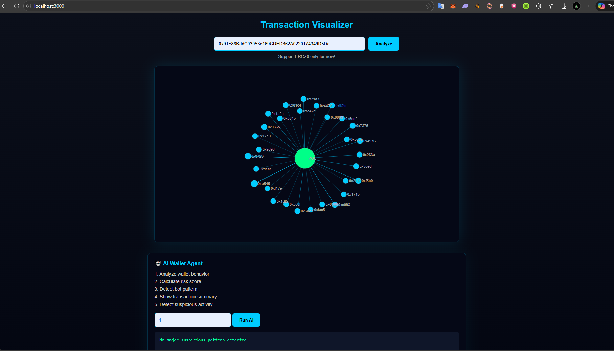

# INTERCOM – Transaction Visualizer + AI Wallet Agent



A lightweight on-chain transaction visualizer with an integrated AI Agent for wallet behavior analysis.

---

## 📍 TRAC ADDRESS

```
trac1s0vkcsuul4qtfjyp0q8c9v2ymva3999jpudj95znr7s3d58xp7gq03euke
```

---

## 🚀 Overview

INTERCOM is a web-based wallet intelligence dashboard that allows users to:

- Visualize recent wallet transactions
- Analyze wallet behavior patterns
- Detect potential bot activity
- Generate a simplified risk score
- View summarized transaction insights

The system fetches the latest 50 transactions and renders them using a D3 force graph.

Currently supports **ERC20 (Ethereum Mainnet)**.

---

## 🧠 AI Wallet Agent

Below the transaction graph, users can access an interactive AI Agent.

The AI Agent supports:

1. Analyze wallet behavior  
2. Calculate risk score  
3. Detect bot pattern  
4. Show transaction summary  
5. Detect suspicious activity  

Users simply input a number (1–5) to trigger the selected AI analysis mode.

The AI Agent is designed to simulate on-chain behavioral intelligence in a lightweight and extensible way.

---

## 📊 How It Works

1. User inputs a wallet address.
2. Backend fetches the latest 50 transactions via Etherscan API.
3. Transactions are mapped into nodes and links.
4. D3 renders a force-directed transaction graph.
5. AI Agent analyzes wallet behavior using selectable heuristic modes.

---

## 🌐 Current Support

- ✅ ERC20 (Ethereum Mainnet)
- ⚠️ SOL (Coming Soon)
- ⚠️ TRAC Network (Under Development)

Multi-chain support is planned as the next milestone.

---

## 🛠 Tech Stack

- Node.js
- Express
- D3.js v7
- Etherscan API (v2)
- Modular architecture (feature-based structure)

---


## ⚙️ Installation

### 1. Clone repository
```bash
git clone https://github.com/MrHaans/wallet-visualizer
cd wallet-visualizer
```

### 2. Install dependencies
```bash
npm install
```

### 3. Run Locally
```bash
node web-server.js
```

---

## 🔮 Roadmap

- Multi-chain support (SOL integration)
- Native TRAC Network transaction parser
- Advanced AI scoring engine
- Real-time wallet monitoring
- Cross-chain behavioral analytics

---

## 👑 Created with Passion By

**MRHAANS**

---